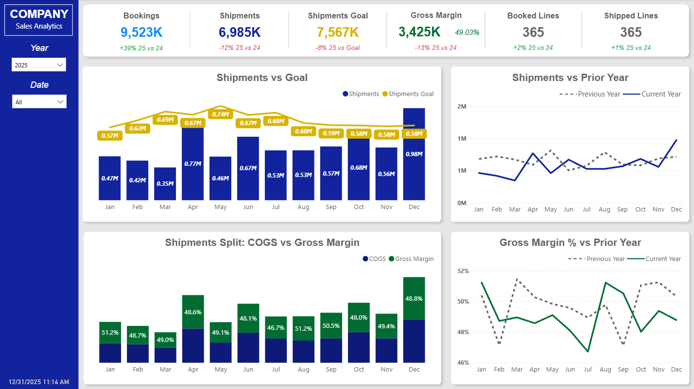

# 📊 Sales Analytics Dashboard

> An interactive Power BI dashboard for monitoring sales performance, profitability, and operational KPIs using Power BI, DAX, and Power Query.


---

# Executive Summary

Organizations rely on timely and accurate sales reporting to monitor performance, evaluate profitability, and measure progress toward business goals. This project demonstrates the development of an executive-level analytics dashboard that consolidates sales data into a single interactive reporting solution.

Built in **Microsoft Power BI**, this dashboard combines bookings, shipments, shipment goals, and gross margin metrics into an intuitive interface designed for business users. Through advanced DAX calculations, Power Query transformations, and dimensional data modeling, the report enables users to analyze trends, compare historical performance, and identify operational opportunities.

> **Note:** All data contained in this repository is fictional and was created solely for demonstration and portfolio purposes.

---

# Dashboard Preview



---

# Business Objectives

This dashboard was designed to answer common executive reporting questions.

| Business Question | Dashboard Solution |
|-------------------|--------------------|
| Are shipments meeting monthly goals? | Shipments vs Goal visualization |
| How does this year compare to last year? | Dynamic Year-over-Year analysis |
| Is profitability improving? | Gross Margin KPI and trend analysis |
| How are bookings trending? | Executive KPI scorecards |
| What are monthly sales trends? | Interactive monthly visualizations |

---

# Dashboard Features

## Executive KPI Scorecards

The dashboard provides high-level visibility into key business metrics.

**KPIs Included**

- Bookings
- Shipments
- Shipment Goals
- Gross Margin
- Gross Margin %
- Booked Lines
- Shipped Lines

Each KPI includes dynamic Year-over-Year comparisons and conditional formatting to quickly identify performance changes.

---

## Shipment Performance

Track monthly shipment activity against organizational goals.

### Capabilities

- Monthly shipment totals
- Goal comparison
- Variance analysis
- Interactive filtering

---

## Year-over-Year Analysis

Compare current performance against prior periods using custom DAX time intelligence.

### Features

- Previous Year comparisons
- Monthly trend analysis
- Dynamic KPI calculations

---

## Profitability Analysis

Analyze profitability using Gross Margin and Gross Margin %.

The dashboard separates Cost of Goods Sold (COGS) from Gross Margin to provide a clearer understanding of financial performance throughout the year.

---

# Data Model

The dashboard is built using a relational star schema consisting of multiple fact tables and a shared Date dimension.

```
                Date
                 │
        ┌────────┼────────┐
        │                 │
 Sales Booked      Sales Invoiced
        │                 │
        └────────┬────────┘
                 │
          Shipment Goals
```

---

# Data Pipeline

```
Excel Data Sources
        │
        ▼
Power Query ETL
        │
        ▼
Data Cleaning & Transformation
        │
        ▼
Data Modeling
        │
        ▼
DAX Measures
        │
        ▼
Interactive Power BI Dashboard
```

---

# Technical Implementation

## Data Sources

The dashboard utilizes three datasets:

- Sales Booked
- Sales Invoiced
- Shipment Goals

A dedicated Date table supports all time intelligence calculations.

---

## Power Query

Power Query was used to prepare and transform the source data.

### Transformations

- Data cleansing
- Type conversion
- Date normalization
- Relationship preparation
- Query optimization

---

## DAX

Advanced DAX measures power the dashboard.

### Implemented Calculations

- Year-over-Year comparisons
- Gross Margin
- Gross Margin %
- Shipment Goal variance
- Dynamic KPI calculations
- Time Intelligence
- Conditional formatting
- Performance indicators

---

## Data Modeling

The report follows dimensional modeling principles using:

- Fact tables
- Date dimension
- One-to-many relationships
- Star schema design

---

# Technologies Used

| Technology | Purpose |
|------------|---------|
| Microsoft Power BI | Dashboard Development |
| DAX | Business Logic |
| Power Query | ETL |
| Excel | Data Source |
| Data Modeling | Relational Analytics |

---

# Repository Structure

```
sales-analytics-dashboard/
│
├── dashboard/
│   └── Sales_Analytics_Dashboard.pbix
│
├── data/
│   ├── Sales_Booked.xlsx
│   ├── Sales_Invoiced.xlsx
│   └── Shipments_Goal.xlsx
│
├── images/
│   └── dashboard-overview.png
│
├── LICENSE
└── README.md
```

---

# Skills Demonstrated

## Business Intelligence

- Executive Dashboard Design
- KPI Reporting
- Interactive Reporting
- Business Analytics

## Data Modeling

- Star Schema Design
- Relationship Modeling
- Date Dimension
- Fact Tables

## Power BI

- Advanced DAX
- Power Query
- Time Intelligence
- Dynamic Measures
- Conditional Formatting

## Analytics

- Trend Analysis
- Variance Analysis
- Profitability Reporting
- Goal Tracking
- Year-over-Year Comparisons

---

# Future Enhancements

Potential improvements include:

- SQL database integration
- REST API data ingestion
- Incremental Refresh
- Drill-through reporting
- Customer analytics
- Product analytics
- Forecasting models
- Role-Level Security (RLS)

---

# Getting Started

1. Clone or download this repository.
2. Open `dashboard/Sales_Analytics_Dashboard.pbix` using Microsoft Power BI Desktop.
3. If prompted, reconnect the report to the sample Excel files located in the `data/` folder.
4. Refresh the data model.

---

# Data Disclaimer

All datasets included in this repository are entirely fictional and were created solely for educational and portfolio purposes.

No proprietary, confidential, or customer information is contained within this repository.

---

# Author

**Austin Thomas**

Data Engineer | Business Intelligence Developer

- GitHub: https://github.com/AustinEThomas
- LinkedIn: https://www.linkedin.com/in/auethomas
- Portfolio: https://austine thomas.github.io *(replace with your final URL if different)*

---

⭐ If you found this project interesting, consider starring the repository!
